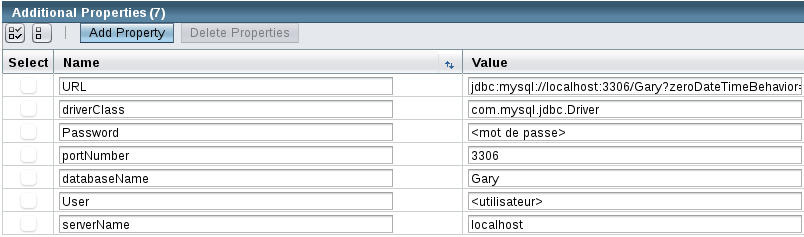
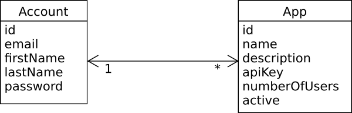
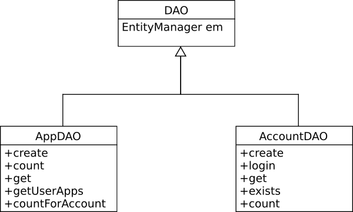

# Documentation
Manuel d'installation
=====================

Base de données
---------------

Notre application utilise JPA pour la persistence des données et ce dernier enregistre ses données dans une base de données. L'application requiert donc une base de données fonctionnelle:

- Disposer d'un serveur de base de données fonctionnel (testé avec MySQL)
- Disposer d'un utilisateur ayant les droits d'accès et d'écriture sur ce serveur
- Créer la base de données ```Gary``` qui servira à contenir les données de l'application

La suite de la configuration s'effectue dans le serveur d'application utilisé, dans notre cas il s'agit de Glassfish. Sa console d'administration se situe à l'adresse: ```https://<IP du serveur Glassfish>:4848/```

Ensuite, dans Glassfish, créer un pool de connexion vers le serveur de base de données comme suit:



Où l'URL équivaut à : ```jdbc:mysql://<IP du serveur MySQL>:3306/Gary?zeroDateTimeBehavior=convertToNull```

Enfin, il faut créer une ressource JDBC liée à ce pool de connexion et portant le  nom ```jdbc/GaryDatasource```.

Schéma de persistence
==========================
Pour stocker les données, nous avons défini plusieurs entités que JPA utilise pour créer et gérer la base de données. Ces entités représentent les unités logiques de l'application.

Actuellement, dans la première partie, nous gérons deux unités principales:



- Les comptes, identité d'un administrateur d'applications. Les comptes sont créés et modifiés depuis l'interface Web. Un utilisateur qui se crée un compte peut alors créer et gérer ses propres applications. Un compte est caractérisé par les propriétés suivantes:

    - id : identifiant unique attribué automatiquement par la base de données

    - mail : adresse email de l'utilisateur. C'est cette adresse, unique dans la base de données, qui est utilisée comme identifiant principal lors de la connexion

    - firstName : prénom de l'utilisateur

    - lastName : nom de famille de l'utilisateur

    - password : mot de passe de l'utilisateur, spécifié à l'inscription et utilisé pour la connexion en conjonction avec l'adresse email. Afin qu'il soit un minimum sécurisé, le mot de passe est contraint à posséder au moins 8 caractères

    - createdApps : l'utilisateur est lié aux application qu'il a créées depuis son inscription sur le site

- Comme mentionné ci-dessus, les applications que les administrateurs peuvent créer. Une application est liée à l'utilisateur qui l'a créée et n'est administrable que par lui. Une application est caractérisée par:

    - id : identifiant unique attribué automatiquement par la base de données
    - name : nom de l'application

    - description : description décrivant l'utilité de l'application

    - apiKey : clé (unique) générée à la création de l'application permettant de s'en servir

    - numberOfUsers : nombre maximum d'utilisateurs qu'accepte l'application

    - active : statut de l'application, peut être activée ou désactivée (non utilisable)

    - creator : lien vers l'identité de la personne qui a créé l'application et qui peut l'administrer

Une troisième entité ```Role``` permettant d'assigner des rôles aux comptes existe mais n'est pas utilisée dans cette première partie. Néanmoins, l'entité est déjà prête pour son utilisation future.

Gestion des données
==================
Afin de pouvoir facilement gérer ces données, nous avons créé des *DAO*: *Data Access Object*. Ces objets vont permettre à leurs utilisateurs de travailler uniquement sur les données sans se soucier du contexte de persistence.

À l'interne de Java EE, ces classes un peu spéciales sont des *SLSB* et sont construits automatiquement par le serveur d'application. Ensuite, les autres *EJB* qui souhaitent avoir accès aux données, vont demander une injection de l'objet comme suit:

```
@EJB
AccountDAO dao;
```

Dans ce cas précis, le DAO responsable de gérer les comptes est injecté dans la référence *dao* et peut directement être utilisé.

Nous avons défini cette structure de *DAO* dans notre application:



La superclasse ```DAO``` sert uniquement à récupérer le contexte de persistence et à stocker la référence vers l'```EntityManager``` que vont utiliser les classes qui en héritent.

- AppDAO sert à gérer les objets représentant les applications, les ```App```
- AccountDAO sert à gérer les objets représentant les comptes, les ```Account```

Pour plus de détails concernant l'utilisation et le rôle de chaque méthodes fournies par les DAO, référez-vous à la javadoc de ces derniers.
