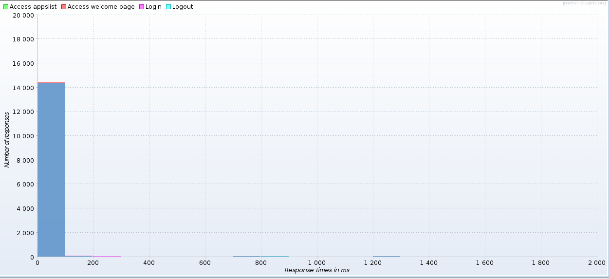
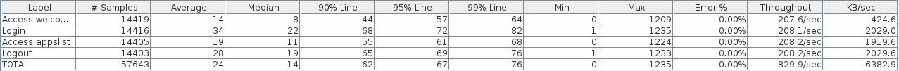

# Documentation
Manuel d'installation
=====================

Base de données
---------------

Notre application utilise JPA pour la persistence des données et ce dernier enregistre ses données dans une base de données. L'application requiert donc une base de données fonctionnelle:

- Disposer d'un serveur de base de données fonctionnel (testé avec MySQL)
- Disposer d'un utilisateur ayant les droits d'accès et d'écriture sur ce serveur
- Créer la base de données ```Gary``` qui servira à contenir les données de l'application

La suite de la configuration s'effectue dans le serveur d'application utilisé, dans notre cas il s'agit de Glassfish. Sa console d'administration se situe à l'adresse: ```https://<IP du serveur Glassfish>:4848/```

Ensuite, dans Glassfish, créer un pool de connexion vers le serveur de base de données comme suit:


Où l'URL équivaut à : ```jdbc:mysql://<IP du serveur MySQL>:3306/Gary?zeroDateTimeBehavior=convertToNull```

Enfin, il faut créer une ressource JDBC liée à ce pool de connexion et portant le  nom ```jdbc/GaryDatasource```.

Application
-----------
La suite de la mise en place est nettement plus simple. Elle requiert un environnement de développement pour Java Entreprise Edition ainsi qu'un serveur d'application. L'application a été testée avec un environnement Netbeans + Glassfish.

- Installer l'environnement de développement complet disponible sur [le site de netbeans](https://netbeans.org/downloads/)

- Cloner [le dépôt](https://github.com/jurporan/Teaching-HEIGVD-AMT-2015-Project.git) contenant l'application

- Ouvrir le projet avec Netbeans (les fichiers à ouvrir se situent dans ```src/Gary/```)

- Construire le projet et le déployer sur le serveur d'application Glassfish inclus

- La page devrait s'être ouverte automatiquement, sinon l'URL par défaut est [http://localhost:8080/Gary](http://localhost:8080/Gary)

Vous pouvez maintenant utiliser normalement notre application.

Schéma de persistence
==========================
Pour stocker les données, nous avons défini plusieurs entités que JPA utilise pour créer et gérer la base de données. Ces entités représentent les unités logiques de l'application.

Actuellement, dans la première partie, nous gérons deux unités principales:


- Les comptes, identité d'un administrateur d'applications. Les comptes sont créés et modifiés depuis l'interface Web. Un utilisateur qui se crée un compte peut alors créer et gérer ses propres applications. Un compte est caractérisé par les propriétés suivantes:

    - id : identifiant unique attribué automatiquement par la base de données

    - mail : adresse email de l'utilisateur. C'est cette adresse, unique dans la base de données, qui est utilisée comme identifiant principal lors de la connexion

    - firstName : prénom de l'utilisateur

    - lastName : nom de famille de l'utilisateur

    - password : mot de passe de l'utilisateur, spécifié à l'inscription et utilisé pour la connexion en conjonction avec l'adresse email. Afin qu'il soit un minimum sécurisé, le mot de passe est contraint à posséder au moins 8 caractères

    - createdApps : l'utilisateur est lié aux application qu'il a créées depuis son inscription sur le site

- Comme mentionné ci-dessus, les applications que les administrateurs peuvent créer. Une application est liée à l'utilisateur qui l'a créée et n'est administrable que par lui. Une application est caractérisée par:

    - id : identifiant unique attribué automatiquement par la base de données
    - name : nom de l'application

    - description : description décrivant l'utilité de l'application

    - apiKey : clé (unique) générée à la création de l'application permettant de s'en servir

    - numberOfUsers : nombre maximum d'utilisateurs qu'accepte l'application

    - active : statut de l'application, peut être activée ou désactivée (non utilisable)

    - creator : lien vers l'identité de la personne qui a créé l'application et qui peut l'administrer

Une troisième entité ```Role``` permettant d'assigner des rôles aux comptes existe mais n'est pas utilisée dans cette première partie. Néanmoins, l'entité est déjà prête pour son utilisation future.

#Architecture

Notre application suit un modèle MVC.

Les servlets jouent le rôle des contrôleurs. Les servlets de l'applications  se trouvent tous dans le paquet ``ch.heigvd.amt.gary.controllers``. Chacun d'entre eux gère une partie différente de l'application.

Pour effectuer certaines tâches ils font appels à des EJBs qui se trouvent dans le paquet ``ch.heigvd.amt.gary.services``.

Les contrôleurs servent des pages JSP qui font fonctions de vues. Toutes les pages JSP se trouvent dans le dossier ``Web Pages/WEB-INF/views/`` du projet. Le dossier ``includes`` qui se trouve au même niveau que les JSP contient des entêtes et pieds-de-pages communs à toutes les pages de l'application.

Les modèles de notre applications sont représentés par les *Entities*, les classes présentent dans le paquet ``ch.heigvd.amt.gary.entities``. Celles-ci ne sont qu'une abstraction des tables contenues dans la base de données MySQL utilisée par l'application. Les *DAOs* présents dans le paquet ``ch.heigvd.amt.gary.services.dao`` permettent de faire le lien entre les entités utilisées par les services de l'application et la base de donnée.

Le paquet ``ch.heigvd.amt.gary.filters`` contient une unique classe utilisée pour filtrer les requêtes envoyées au serveur. Ce filtre sert à contrôler l'accès au différentes parties du site par les utilisateurs. Un utilisateur non-connecté ne pourra ainsi pas accéder à la page listant ses applications.

Finalement le paquet ``ch.heigvd.amt.gary.services.test`` contient un service utilisé pour généré des données de test.

Les tests ont été réalisé en partie avec JUnit et Selenium, dans un projet *GaryUserAcceptanceTest* et en partie à l'aide de JMeter. Des fichier contenant des plans de test JMeter se trouve dans le dossier */tests* de notre repo github.

Gestion des données
-------------------

Afin de pouvoir facilement gérer ces données, nous avons créé des *DAO*: *Data Access Object*. Ces objets vont permettre à leurs utilisateurs de travailler uniquement sur les données sans se soucier du contexte de persistence.

À l'interne de Java EE, ces classes un peu spéciales sont des *SLSB* et sont construits automatiquement par le serveur d'application. Ensuite, les autres *EJB* qui souhaitent avoir accès aux données, vont demander une injection de l'objet comme suit:

```
@EJB
AccountDAO dao;
```

Dans ce cas précis, le DAO responsable de gérer les comptes est injecté dans la référence *dao* et peut directement être utilisé.

Nous avons défini cette structure de *DAO* dans notre application:


La superclasse ```DAO``` sert uniquement à récupérer le contexte de persistence et à stocker la référence vers l'```EntityManager``` que vont utiliser les classes qui en héritent.

- AppDAO sert à gérer les objets représentant les applications, les ```App```
- AccountDAO sert à gérer les objets représentant les comptes, les ```Account```

Pour plus de détails concernant l'utilisation et le rôle de chaque méthodes fournies par les DAO, référez-vous à la javadoc de ces derniers.

#Stratégie de test

Dans le cadre du développement de notre application nous avons effectué plusieurs type de tests.

D'une part nous avons effectués des tests de foncionnalité à l'aide de Selenium. Durant cette première partie du développement il s'agissait surtout de se familiariser avec l'outil et d'effectuer des tests de navigabilité parmi les pages web servies par notre application.

Nous avons également effectué des tests de performances et de charge à l'aide de JMeter. À nouveau il s'agissait surtout de se familariser avec l'outil et également, les tests se réalisant surtout sur des requêtes GET et POST assez basiques.

##Génération des données de test

Afin de pouvoir tester l'application il est nécessaire de générer des données de tests au préalable. Nous avons choisi de le faire à travers un service de notre application. Le ``TestDataService`` (un SLSB) situé dans le paquet ``ch.heigvd.amt.gary.services.test`` possède une méthode ``generateTestData()`` qui insère plusieurs utilisateurs et applications dans la base de données.

Ce service est appelé par le servlet ``TestDataServlet``, lié à l'URL */Gary/generatetestdata*. Une simple ``JSP`` indique que la génération des données a été accomplie. Cette page n'est pas très soignée car elle n'a pas vocation à faire partie de l'application une fois celle-ci déployée pour de bon.

En résumé, pour insérer des données de test dans la base de données il suffit d'accéder à l'URL */Gary/generatetestdata* une fois le serveur de l'application lancé.

##Tests de navigabilité avec Selenium

Le but de ces tests était de pouvoir vérifier de manière automatisée que les utilisateurs de notre application ont bien accès aux différentes pages servies pare cette dernière suivant qu'ils soient connecté ou non.

Les tests sont réalisés dans un projet à part nommé **GaryUserAcceptanceTest**. Il s'agit d'un projet vide ne contenant que des tests *JUnit* réalisé à l'aide de *Selenium*. On peut lancer les tests depuis l'IDE *NetBeans*, en compilant le projet.

Le scénario de test ``aUserShouldBeAbleToAccessAllNonUserSpecificPagesWhenNotLoggedIn`` consiste simplement à vérifier qu'un utilisateur non connecté à accès à la page d'accueil, à la page de login et à la page de création de compte.

Le scénario de test ``aUserShouldBeRedirectedToLoginPageWhenTryingToAccesUserSpecificPagesWhenNotLoggedIn`` consiste à vérifier qu'un utilisateur non connecté n'a pas accès aux autres pages de l'application.

Le scénario de test ``itShouldNotBePossibleToLoginWithANonExistantAccount`` vérifie simplement que des identifiants incorrectes ne permettent pas de se connecter à l'application.

Le scénario de test ``aUserShouldBeRedirectedToHisAppsListPageAfterLoggingIn`` contrôle qu'un utilisateur qui se connecte est redirigé vers la page où ses applications sont listées.

Le scénario de test ``aUserShouldBeAbleToAccesTheEditAccountPageAfterLoggingIn`` contrôle qu'un utilisateur connecté à accès à la page d'édition de son compte (inaccessible lors du scénario de test ``aUserShouldBeRedirectedToLoginPageWhenTryingToAccesUserSpecificPagesWhenNotLoggedIn``)

Le scénario de test ``aUserShouldNotBeAbleToAccesTheLoginPageAfterLoggingIn`` contrôle qu'un utilisateur connecté n'a pas accès à la page de login.

##Test de performances et de charge avec JMeter

Les test de perfromances visaient à voir si les temps de réponse de notre application étaient satisfaisant et jusqu'à quelle charge le serveur pouvait supporter tout en gardant des temps de réponse satisfaisant.

Nous avons mis en place plusieur *Test Plans* JMeter pour réalisé ces tests. Ils se trouvent dans le dossier *test* de notre repo github. Pour les lancer il suffit de lancer notre application puis d'ouvrir un des fichiers se situant dans le dossier *test* avec JMeter. Il suffit ensuite de lancer depuis l'interface de JMeter. Les *Test Plans* possède déjà des éléments permettant de visualiser les résultats.

###Test de performance

Un premier *Test Plan* nommé *performances.jmx* vise à tester les performances de notre application lorsqu'il y a une charge relativement faible. 

Le test lance 25 threads qui vont simplement accéder à la page d'accueil de l'application, se connecter et accèder à la page listant les applications avant de se déconnecter.

En observant les résultats on constater que le temps de réponse moyen pour toutes ces requêtes est realtivement stable et surtout globalement bas.


Bien qu'il y ait quelques pics ici ou là, ils ne sont pas significatifs et on peut voir que la répartition des temps de réponses est massivement situé en dessous de la barre des 100 ms :



Ceci est encore confirmé en observant le tableau ci-dessous. Outre la constation que tout ce déroule correctement (aucunes erreurs), on peut voir que 99% des requêtes prennent moins de 80 ms et que la moitié se situent en dessous de la barre des 20 ms.



Ces résultats semblent indiquer que notre application fonctionne bien, il n'y a pas de problème de performance à priori. Il faut toutefois nuancer le propos en soulignant que les opérations effectuées durant le test sont relativement simples, même s'il elles effectuent, pour certaines d'entre elles, des appels à la base de données.

###Test de charge

Ce second *Test Plan* Jmeter nommé *charge.jmx* vise à observer la réaction de notre application lorsque la charge est plus importante. Dans ce test on effectue des opérations semblables au test précédent : on accède à la page d'accueil de l'application, on se connecte et on accède 10 fois à la page d'application, avant de se déconnecté.

La différence se trouve dans le nombre de threads, 1000 au total. Ils ne sont toutefois pas lancés en même temps mais de manière incrémentales, à raison de 200 toutes les minutes, afin de pouvoir distinguer le comportement de l'application aux différents niveaux de charge.


Ce graphique indique le nombre de threads actifs à un moment donné durant le test, mis en relation avec le graph en dessous il nous permet d'estimer la moyenne des temps de réponse selon le nombre de threads.


On peut ainsi observer, sans grande surprise, que plus il y a de requête et plus le serveur de notre application met du temps pour répondre à ces requêtes. On peut toutefois constater que lorsque 600 threads envoient des requêtes en même temsp le temps de réponse moyen d'une requête GET pour la page d'accueil dépasse alégrement la seconde. Et à partir de 1000 threads on franchi le cape des 2 secondes.

Il n'est pas question ici de savoir s'il s'agit de bonnes ou de mauvaises performances. Ce test a en effet un but plutôt informatif.

# Résultat

Voici des captures d'écran de notre travail:

### Page d'accueil

### Page de login

### Page d'enregistrement

### Page de liste des appliclations

### Page de création d'application

### Page d'édition


