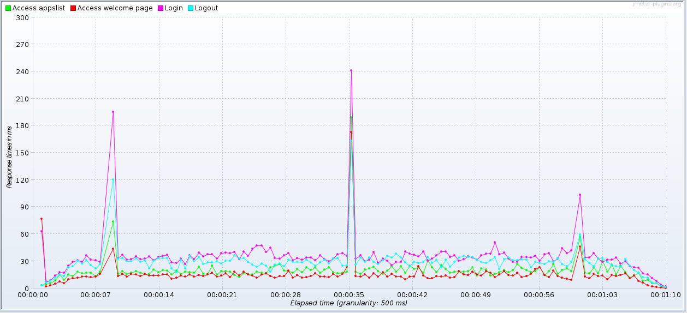
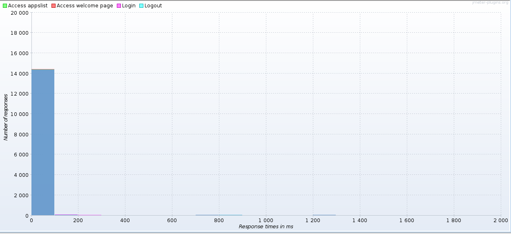
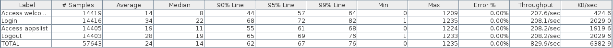

#Stratégie de test

Dans le cadre du développement de notre application nous avons effectué plusieurs type de tests.

D'une part nous avons effectués des tests de foncionnalité à l'aide de Selenium. Durant cette première partie du développement il s'agissait surtout de se familiariser avec l'outil et d'effectuer des tests de navigabilité parmi les pages web servies par notre application.

Nous avons également effectué des tests de performances et de charge à l'aide de JMeter. À nouveau il s'agissait surtout de se familariser avec l'outil et également, les tests se réalisant surtout sur des requêtes GET et POST assez basiques.

##Génération des données de test

Afin de pouvoir tester l'application il est nécessaire de générer des données de tests au préalable. Nous avons choisi de le faire à travers un service de notre application. Le ``TestDataService`` (un SLSB) situé dans le paquet ``ch.heigvd.amt.gary.services.test`` possède une méthode ``generateTestData()`` qui insère plusieurs utilisateurs et applications dans la base de données.

Ce service est appelé par le servlet ``TestDataServlet``, lié à l'URL */Gary/generatetestdata*. Une simple ``JSP`` indique que la génération des données a été accomplie. Cette page n'est pas très soignée car elle n'a pas vocation à faire partie de l'application une fois celle-ci déployée pour de bon.

En résumé, pour insérer des données de test dans la base de données il suffit d'accéder à l'URL */Gary/generatetestdata* une fois le serveur de l'application lancé.

##Tests de navigabilité avec Selenium

Le but de ces tests était de pouvoir vérifier de manière automatisée que les utilisateurs de notre application ont bien accès aux différentes pages servies pare cette dernière suivant qu'ils soient connecté ou non.

Les tests sont réalisés dans un projet à part nommé **GaryUserAcceptanceTest**. Il s'agit d'un projet vide ne contenant que des tests *JUnit* réalisé à l'aide de *Selenium*. On peut lancer les tests depuis l'IDE *NetBeans*, en compilant le projet.

Le scénario de test ``aUserShouldBeAbleToAccessAllNonUserSpecificPagesWhenNotLoggedIn`` consiste simplement à vérifier qu'un utilisateur non connecté à accès à la page d'accueil, à la page de login et à la page de création de compte.

Le scénario de test ``aUserShouldBeRedirectedToLoginPageWhenTryingToAccesUserSpecificPagesWhenNotLoggedIn`` consiste à vérifier qu'un utilisateur non connecté n'a pas accès aux autres pages de l'application.

Le scénario de test ``itShouldNotBePossibleToLoginWithANonExistantAccount`` vérifie simplement que des identifiants incorrectes ne permettent pas de se connecter à l'application.

Le scénario de test ``aUserShouldBeRedirectedToHisAppsListPageAfterLoggingIn`` contrôle qu'un utilisateur qui se connecte est redirigé vers la page où ses applications sont listées.

Le scénario de test ``aUserShouldBeAbleToAccesTheEditAccountPageAfterLoggingIn`` contrôle qu'un utilisateur connecté à accès à la page d'édition de son compte (inaccessible lors du scénario de test ``aUserShouldBeRedirectedToLoginPageWhenTryingToAccesUserSpecificPagesWhenNotLoggedIn``)

Le scénario de test ``aUserShouldNotBeAbleToAccesTheLoginPageAfterLoggingIn`` contrôle qu'un utilisateur connecté n'a pas accès à la page de login.

##Test de performances et de charge avec JMeter

Les test de perfromances visaient à voir si les temps de réponse de notre application étaient satisfaisant et jusqu'à quelle charge le serveur pouvait supporter tout en gardant des temps de réponse satisfaisant.

Nous avons mis en place plusieur *Test Plans* JMeter pour réalisé ces tests. Ils se trouvent dans le dossier *test* de notre repo github. Pour les lancer il suffit de lancer notre application puis d'ouvrir un des fichiers se situant dans le dossier *test* avec JMeter. Il suffit ensuite de lancer depuis l'interface de JMeter. Les *Test Plans* possède déjà des éléments permettant de visualiser les résultats.

###Test de performance

Un premier *Test Plan* nommé *performances.jmx* vise à tester les performances de notre application lorsqu'il y a une charge relativement faible. 

Le test lance 25 threads qui vont simplement accéder à la page d'accueil de l'application, se connecter et accèder à la page listant les applications avant de se déconnecter.

En observant les résultats on constater que le temps de réponse moyen pour toutes ces requêtes est realtivement stable et surtout globalement bas.

Bien qu'il y ait quelques pics ici ou là, ils ne sont pas significatifs et on peut voir que la répartition des temps de réponses est massivement situé en dessous de la barre des 100 ms :

Ceci est encore confirmé en observant le tableau ci-dessous. Outre la constation que tout ce déroule correctement (aucunes erreurs), on peut voir que 99% des requêtes prennent moins de 80 ms et que la moitié se situent en dessous de la barre des 20 ms.

Ces résultats semblent indiquer que notre application fonctionne bien, il n'y a pas de problème de performance à priori. Il faut toutefois nuancer le propos en soulignant que les opérations effectuées durant le test sont relativement simples, même s'il elles effectuent, pour certaines d'entre elles, des appels à la base de données.

###Test de charge

Ce second *Test Plan* Jmeter nommé *charge.jmx* vise à observer la réaction de notre application lorsque la charge est plus importante. Dans ce test on effectue des opérations semblables au test précédent : on accède à la page d'accueil de l'application, on se connecte et on accède 10 fois à la page d'application, avant de se déconnecté.

La différence se trouve dans le nombre de threads, 1000 au total. Ils ne sont toutefois pas lancés en même temps mais de manière incrémentales, à raison de 200 toutes les minutes, afin de pouvoir distinguer le comportement de l'application aux différents niveaux de charge.

Ce graphique indique le nombre de threads actifs à un moment donné durant le test, mis en relation avec le graph en dessous il nous permet d'estimer la moyenne des temps de réponse selon le nombre de threads.

On peut ainsi observer, sans grande surprise, que plus il y a de requête et plus le serveur de notre application met du temps pour répondre à ces requêtes. On peut toutefois constater que lorsque 600 threads envoient des requêtes en même temsp le temps de réponse moyen d'une requête GET pour la page d'accueil dépasse alégrement la seconde. Et à partir de 1000 threads on franchi le cape des 2 secondes.

Il n'est pas question ici de savoir s'il s'agit de bonnes ou de mauvaises performances. Ce test a en effet un but plutôt informatif.

