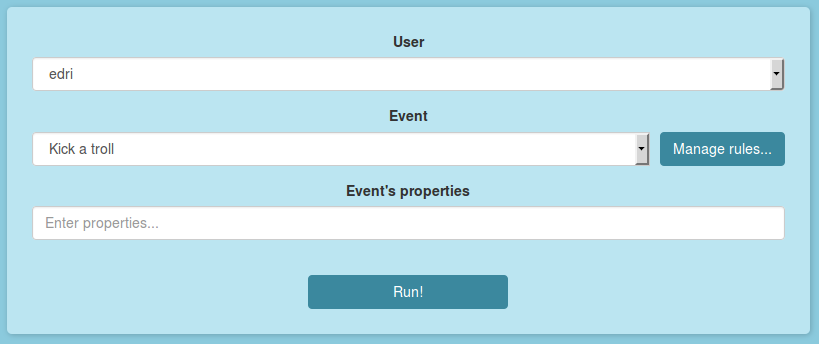
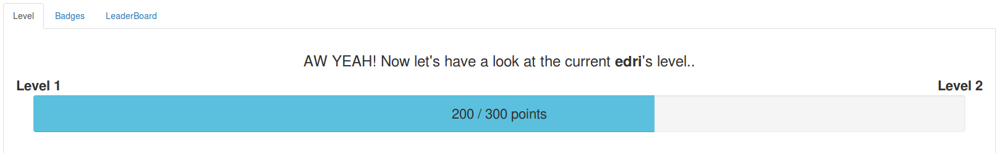
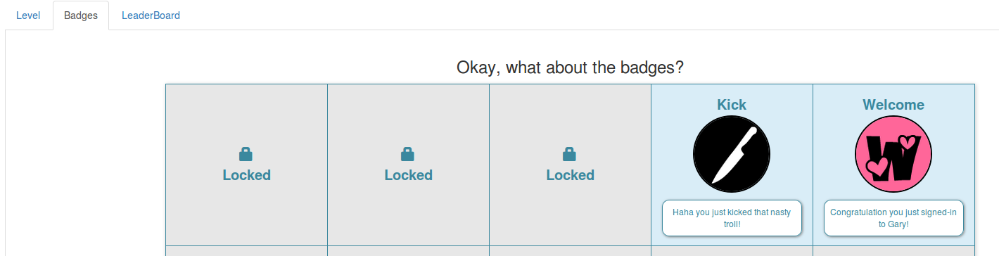
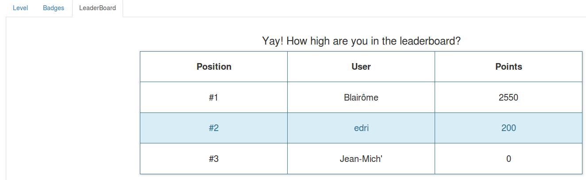
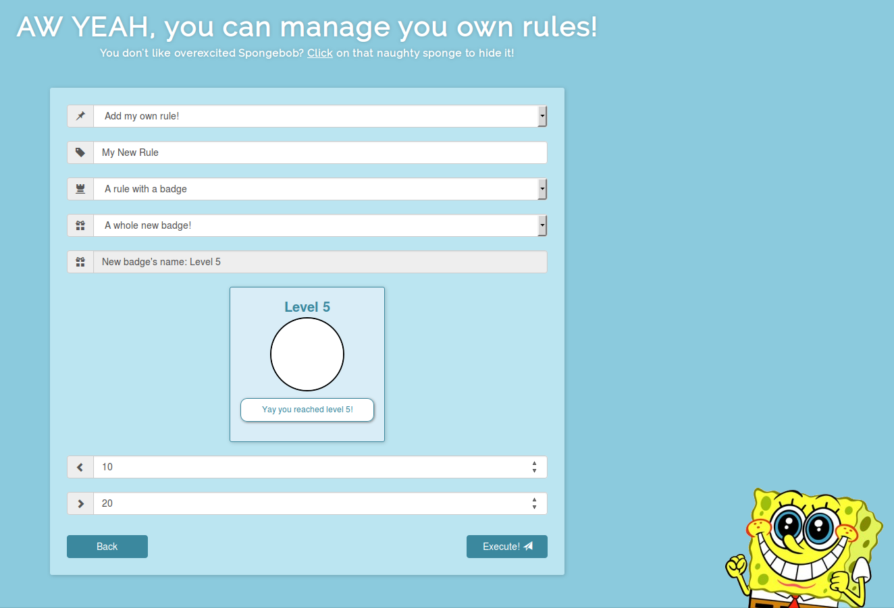
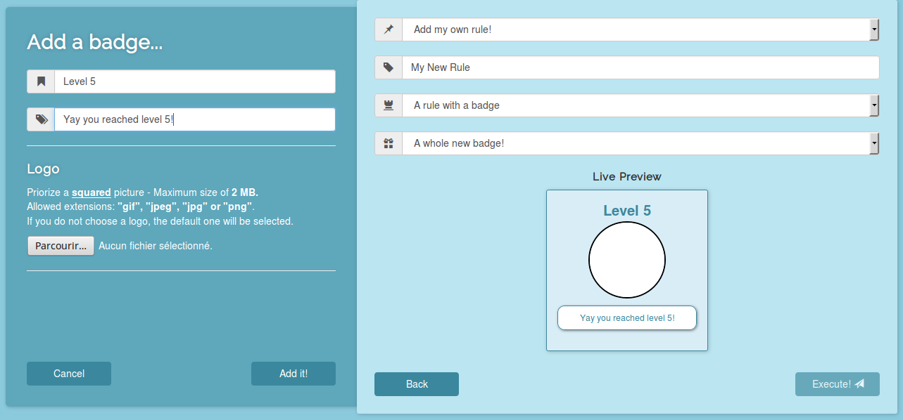

# Gary - Demo

### Install

 - `npm install`
 - `bower install`

### Run

 - First of all, start the **Gary** JavaEE application.
 - Then create a new application with **Gary** and get it's API key.
 - Go in the "*/demo/routes/index.js*" file and add the right API key on line 6.
 - In case your JavaEE **Gary** application is not located at the same place as this app, update the Gary's address on line 7.
 - Run server with `grunt`.
 - Go to http://localhost:3005/.
 - The demo application will create some data just for you ♥.

Enjoy!

### Index page
In this page you can create event and link them to users. First select an user among the three already created ones, then select an event and finally press the "*Run!*" button. Notice than the "properties" field is not used yet so you don't have to fill it.

Once you runned the event you can access the user's stats tabs, in which you can see his current points and badges, and the global leaderboard of the application.

Firstly you can access user's points:

Then you can see the (un)locked user's badges. If you move the cursor hover a locked badge you can see information about it.

And finally you can watch the leaderboard to see if who's the master ; Blairôme is on fire!

If you want to run events for a user different that the one you selected, please refresh the page.

### Rules management page
This page allows you to manage rules, by creating, editing and deleting them. First select the action you want, then follow what the application asks, and finally press the "*Execute!*" button. Please notice that the minimum and maximum properties values will be stored in the database but are not used in the application yet.

You can also create a new badge when adding or editing a rule. You will be able to see your badge's rendering on live ; isn't that beautiful? Please no

Oh, and don't click on Spongebob... This guy always want to show off.
